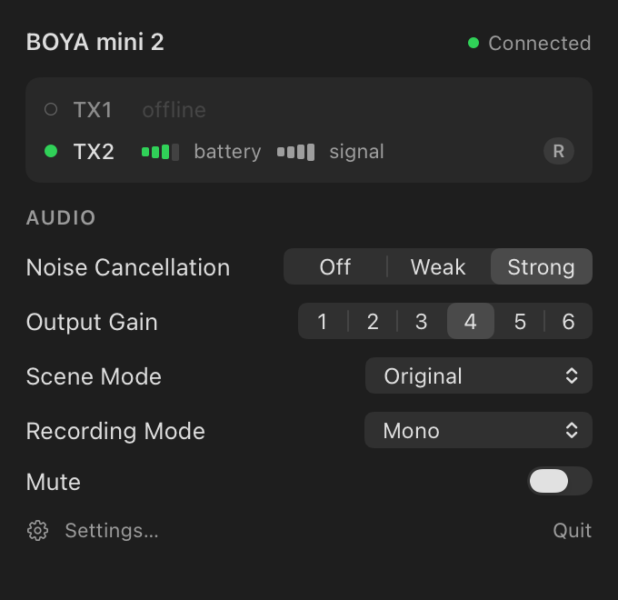

<p align="center">
  
</p>

# BoyaManager

A macOS menu bar app for the **BOYA mini 2** wireless mic. It shows you the mic battery level in the menu bar and reads and let's you change various settings that are otherwise inaccessible without an app.

BOYA's own application does not support this mic model and is generally pretty terrible. 

<h3 align="center"><a href="#reverse-engineering">Skip to the reverse engineering →</a></h3>

<p align="center">
  
</p>

## What it does

Clicking the menu bar icon opens a window containing three things.

- The connection state of the usb dongle.

- One row for each mic giving its online state, battery level, signal level, charging state and assigned channel.

- Controls for noise cancellation, output gain, scene mode, recording mode and mute.

The menubar icon will tell you when the mic's battery is low, when a mic connects or disconnects and when the usb dongle is unplugged.

It runs as a normal user and does not require root.

### The menu bar icon

| | State | Meaning |
|:---:|---|---|
|  | A mic is connected | The bars are that mic's battery level from 0 to 4. The app draws one dot for each mic connected. |
|  | Two mics are online | The dots say how many mics are online and not which ones. The bars show the level of whichever mic has less battery remaining. |
|  | No mic is online | The usb dongle is connected and responding and no mic is switched on. |
|  | Connecting | The app is opening a session or waiting to retry after a failure. The icon fades in and out for as long as that lasts. That fade is what separates it from the state where no mic is online. |
|  | No usb dongle | No usb dongle is plugged in. |

## Requirements

- The device should be a BOYA mini 2 with USB id `0x2F05:0x003B`. Other BOYA models
may use the same protocol with a different set of attributes but I haven't tested.

- macOS 15 or later on Apple silicon.

## Install

<!-- insert homebrew instructions when available -->

## Settings

- mic indicator lights

- mic auto power off and 

- usb dongle auto power off.

- Factory reset. This takes two confirmations because it also clears the mic's pairings.

## CLI

```sh
swift run BoyaManager --probe               # open a session and print every attribute
swift run BoyaManager --probe --get nc      # read one attribute and print its status byte
swift run BoyaManager --render-icons <dir>  # write the menu bar icon in every state at 8×
swift run BoyaManager --render-ui <dir>     # write snapshots of the window and settings
swift run BoyaManager --dump-log            # print the log stream command for the app
```

Quit the app before running `--probe`. Interface 1 is opened exclusively and will fail if the app is holding it.

## Reverse engineering

The settings (aka "attributes") on the usb dongle are interacted with using BOYA's own protocal called **"CFD-Link"**. BOYA publishes no description of the protocol. The protocol description below was found in BOYA's apps and verified against the usb dongle. [`docs/PROTOCOL.md`](docs/PROTOCOL.md).

### The frame format

A frame is a sync byte followed by a header, a payload and a checksum.

```
55 | ver/flags | len | seq | src | dst | svc | chid | vid | pid | msg_id | payload | sum
```

Three rules apply. Breaking any of them means the usb dongle does not answer.

`1.` **The usb dongle sends no reply until the heartbeat exchange is running.** The host
broadcasts a heartbeat every 500 ms and replies to every heartbeat the usb dongle sends.
Both continue for the whole session including the intervals spent waiting for a reply.

`2.` **The usb dongle returns the frames the host sent it.** The host discards every
frame whose `src` field is not 1. Without that check the host replies to its own
heartbeats indefinitely.

`3.` **The attributes are held on a sub-node** rather than on the node that sends the
heartbeats. The host reads the device-describe message from each node and takes the one
with capability bit 2 set. On a mini 2 that node is chid 1, vid 2, pid 29.

A USB packet is not a frame. A `get_all` reply is about 127 bytes and arrives in two
packets, so the host reassembles the byte stream using the length field. Treating each
packet as a frame truncates the attribute list at fourteen entries.

### iAP interface.

This is the route the app takes to reach the control interface. The interface
has class `0xFF` and subclass `0xF0`.

#### iAP2 host

CFD frames are carried on interface 1 inside an iAP2 External Accessory session under
protocol id 177 and protocol name `BOYA.DeviceLink.com`. This is the transport the iOS
application uses through `EASession`.

```
IOUSBHost (interface 1, bulk 0x01/0x81)
  └── iAP2 link layer
        └── External Accessory session, protocol 177 "BOYA.DeviceLink.com"
              └── CFD-Link frames, identical to the frames on interface 0
```

In iAP2 the usb dongle (the accessory) opens the link and the host (the mac) answers. The accessory sends the six bytes `FF 55 02 00 EE 10` and the host responds with the same bytes. The accessory then sends a SYN carrying the link
parameters and the session list and the host answers with SYN|ACK. A SYN sent by the
host gets no reply and the accessory re-enumerates itself shortly afterwards.
`IAP2LinkTests` walks a full transcript and asserts that no code path in the app
originates one.

### Mic Mini 2 specific details

The mic mini 2 implements 24 attributes. The family table in the Android application
lists the full 58 attributes and covers the whole Mic2 range. Absent attributes include the per-mic gain attributes and whole internal-recorder group. 

Through debugging the following was found that is mistated in published info:

- **Attribute 46, `agc`, does not exist on this model** although BOYA's per-model
metadata lists it, it is absent from the `get_all` reply and a direct read of id 46
returns status 1 whether or not a mic is online.

- **Attributes 63 and 64, `tx1_online` and `tx2_online`, are inverted** with respect to
BOYA's labels. The value 1 means online. A mic that is switched off or docked
leaves its battery and signal attributes at their last values rather than dropping them
to zero, so the online attribute is the only reliable indicator of a connection.

## Development

```sh
just gen            # regenerate the Xcode project after adding a file
just app            # build the app bundle
just lint           # SwiftLint, every rule, strict
just ui             # render the window and every settings pane to /tmp
just log            # follow the app's log stream
swift test          # the whole suite, no hardware needed
```

`swift test` runs against a scripted accessory that replays bytes captured from the
usb dongle and implements the accessory side of CFD-Link.  

The hardware test suite needs a usb dongle plugged in:

```sh
BOYA_HARDWARE=1 swift test --filter HardwareTests
```

`HardwareTests` opens interface 1, writes and reads back five attributes, restores
their original values and checks that the usb dongle is on the same IORegistry entry
afterwards. A different entry means the device re-enumerated, which is the indication
that a session was not closed correctly.

The app has no third-party dependencies.
